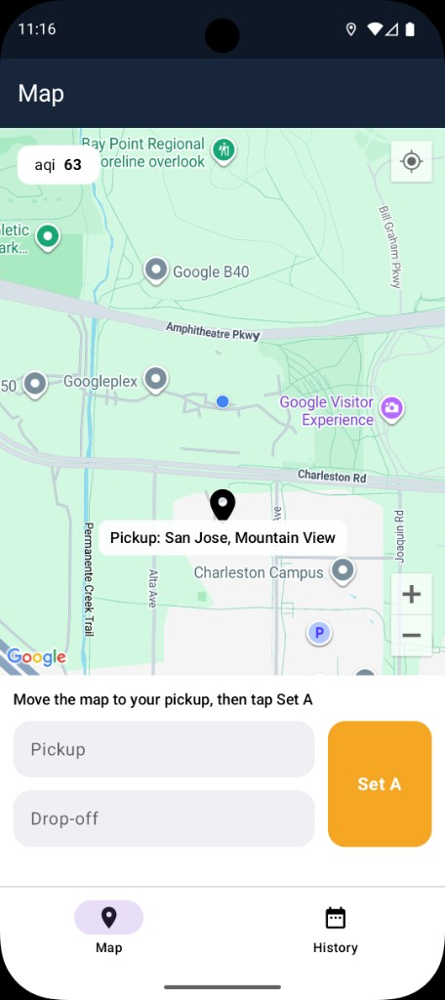
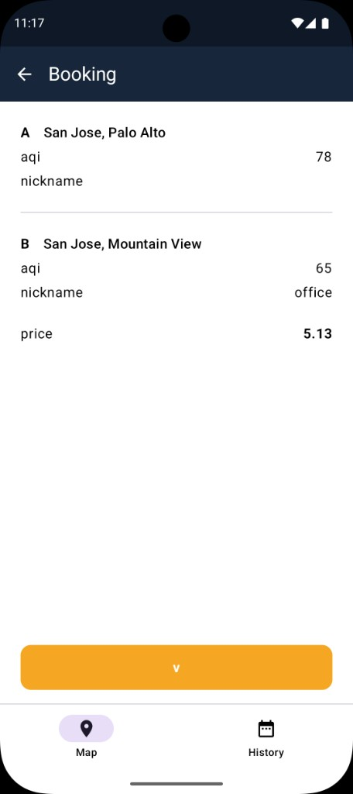
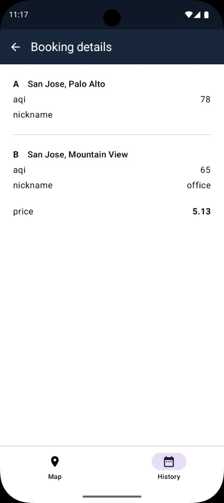
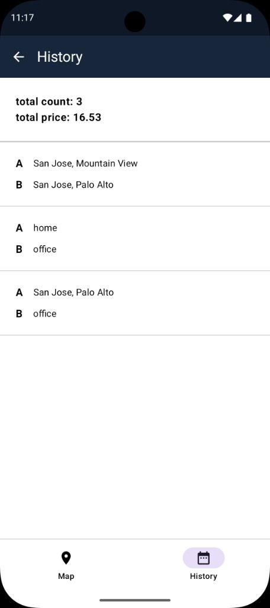

# TADAAssignment

Android app: pick **pickup A** and **drop-off B** on a map, book a trip, then view this month’s history.

Built with **Kotlin**, **Jetpack Compose**, **Hilt**, and **Clean Architecture** (presentation → domain → data).

## Screenshots

<p>
  
  
  
</p>
<p>
  
  
</p>

| Screen | What it shows |
| --- | --- |
| Map — Set A | Center pin, AQI, pickup / drop-off empty, **Set A** |
| Map — Book | A and B filled, **Book** |
| Booking | A/B, AQI, nickname, price, **v** |
| Booking details | Same summary from a history row |
| History | Total count / price and this month’s trips |

## How to run

1. Open the project in Android Studio.
2. Add keys in the project-root `local.properties` (this file is gitignored):

```properties
MAPS_API_KEY=your_google_maps_key
AQICN_TOKEN=demo
```

`MAPS_API_KEY` is required for the map. `AQICN_TOKEN=demo` is enough for a demo; a real [AQICN](https://aqicn.org/api/) token gives local AQI. If live AQI/geocode fail, the pin still gets a mock name and AQI.

`local.properties` is gitignored and not included in this submission, so it won't contain a working `MAPS_API_KEY` — this is intentional, to avoid sharing a live key that could be misused. Add your own Google Maps API key there to run the app; without it, the map view won't render.

3. Run on a device or emulator. Allow **location** when asked so the map can center on you.

## App flow

1. **Map** — Drag the map so the center pin is on pickup, tap **Set A**. Move to a different drop-off, tap **Set B**. Tap **Book**.
2. **Nickname** (optional) — Tap a filled A/B row to add a nickname (max 20, unique). Confirm with **v**.
3. **Saved locations** — Tap an empty Pickup/Drop-off row to pick a place you already set with Set A/B.
4. **Booking** — Shows A, B, AQI, nickname, and price from `POST /books`. Tap **v** to go to History.
5. **History** — This month’s bookings from `GET /books`. Tap a row for details.

A and B cannot be the same place. **Set B** stays disabled until the pin leaves pickup. Book shows a short loading state even though `/books` is mocked.

## Core functionality

| Feature | What it does |
|---|---|
| Map pin | Looks up address + AQI wherever the camera stops |
| AQI | Live AQICN geo feed (far-away “demo” stations are ignored) |
| Address | Live BigDataCloud reverse geocode |
| Book | Mock `POST /books` (in-memory; price from A–B distance) |
| History | Mock `GET /books?year=&month=` for the current month |
| Nicknames | Saved per location; kept if you Set A/B on the same spot again |
| Offline | Book and History require internet |

`GET /area` and `/books` never hit a real backend. An OkHttp mock interceptor answers them. AQICN and BigDataCloud are real HTTP calls.

Lookups are cached by coordinate (~3 decimal places) and **expire after 5 minutes** so AQI is not frozen forever.

## Code structure

```
app/src/main/java/com/example/tadaassignment/
  presentation/   Screens + ViewModels (one VM per screen)
  domain/         Models, repository interfaces, use cases
  data/           Repository impl, Retrofit, mock interceptor, session
  di/             Hilt modules
  ui/theme/       Colors and Compose theme
```

- **Presentation** — Map, nickname, saved locations, booking, history. Shared A/B state lives in `TripDraftStore`, not in one giant ViewModel.
- **Domain** — Use cases: get area, assign/clear slots, nickname, book, history.
- **Data** — `SafeAreaRepositoryImpl` talks to mock `/area` + `/books`, live AQI, and live geocode.

Hilt wires the repository, network monitor, and trip draft store as singletons.

## Tests

From the project root:

```bash
./gradlew :app:testDebugUnitTest
```

Covers location matching, nickname rules, booking online/offline, and A/B steps.
